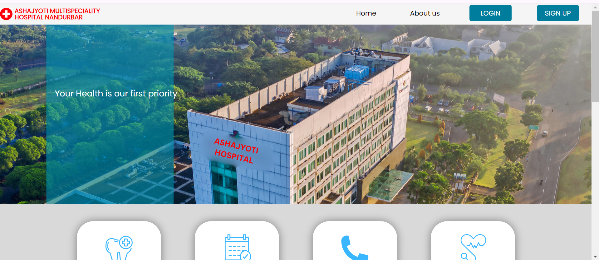
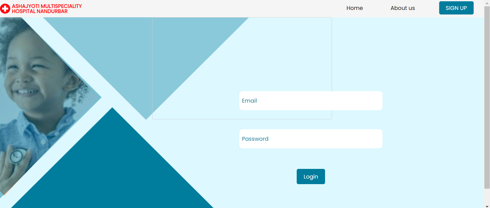
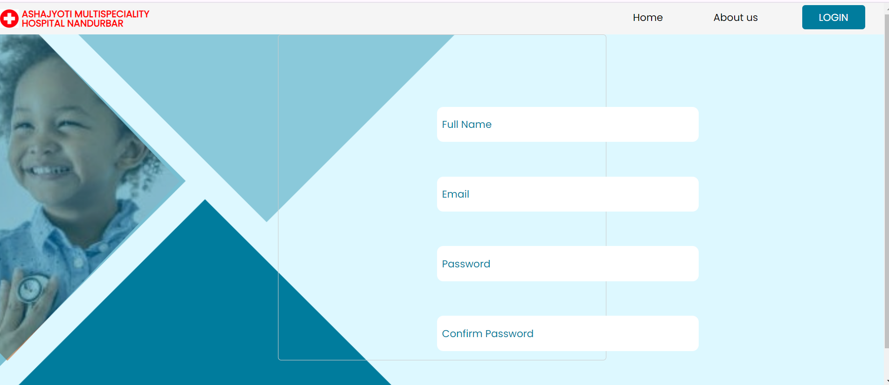

Project Overview

Developed a user-friendly and responsive online patient registration system designed to enhance healthcare management. This project leverages advanced technologies to ensure seamless functionality.

Features 

User Authentication: Provides secure signup and login functionalities with user validation, ensuring data integrity and security.                                             
Patient Management: Allows users to register patients, view patient details, and schedule appointments efficiently.                                                          
Intuitive Navigation: Offers clean and easy navigation, enabling users to access health reports and analysis effortlessly.

Technology Stack

Frontend: HTML5, CSS, JavaScript                                                                                                                                           
Backend: Node.js, Express.js                                                                                                                                             
Database: MySQL

Home Page

Login Page

Sign up Page

